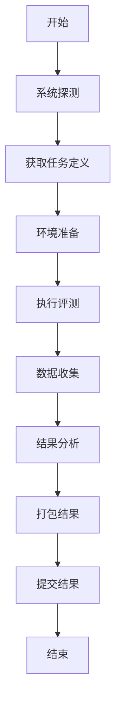

# 实施规范与标准

## 1. 四卡二日志规范

### 1.1 四卡（JSON配置文件）

#### system.json - 系统配置
```json
{
  "hardware": {
    "cpu": {
      "model": "Intel Xeon 8480+",
      "cores": 56,
      "frequency": "3.8GHz",
      "turbo_frequency": "4.2GHz"
    },
    "accelerators": [
      {
        "type": "gpu",
        "vendor": "nvidia",
        "name": "H100",
        "count": 8,
        "memory_gb": 80,
        "firmware": "1.0.0",
        "pcie_gen": 5,
        "interconnect": "nvlink"
      }
    ],
    "memory": {
      "total_gb": 1024,
      "type": "DDR5",
      "speed": "4800MHz"
    },
    "storage": {
      "type": "NVMe SSD",
      "capacity_gb": 2000,
      "read_speed": "7000MB/s",
      "write_speed": "5300MB/s"
    },
    "network": {
      "type": "100GbE",
      "interfaces": 2
    }
  },
  "software": {
    "bios": "2.1.0",
    "driver": "550.54",
    "kernel": "5.15.0",
    "power_sensors": {
      "source": "nvml",  # nvml, rocm_smi, intel_gpu_top, apple_powermetrics, ipmi
      "frequency_hz": 5,
      "accuracy": "±2%"
    }
  }
}
```

#### stack.json - 软件栈配置
```json
{
  "framework": {
    "name": "PyTorch",
    "version": "2.4.0",
    "compute_backend": {
      "type": "cuda",
      "version": "12.4",
      "libraries": {
        "cudnn": "8.9.0"
      }
    }
  },
  "engine": {
    "name": "TensorRT",
    "version": "10.0",
    "optimization_level": 5,
    "graph_mode": true
  },
  "container": {
    "image": "ghcr.io/openaiperf/pytorch:2.4.0-cuda12.4",
    "digest": "sha256:abc123...",
    "base_image": "nvidia/cuda:12.4-devel-ubuntu22.04"
  },
  "environment": {
    "pip_freeze": "requirements.txt",
    "conda_lock": "environment.yml",
    "system_packages": ["nvidia-driver-550", "cuda-toolkit-12.4"]
  },
  "optimizations": {
    "mixed_precision": true,
    "gradient_checkpointing": false,
    "dynamic_batching": true,
    "kv_cache_optimization": true
  }
}
```

#### model.json - 模型配置
```json
{
  "metadata": {
    "name": "llama3-8b",
    "version": "1.0.0",
    "source": "huggingface://meta-llama/Llama-3-8B",
    "license": "Meta License"
  },
  "weights": {
    "sha256": "abc123def456...",
    "download_url": "https://huggingface.co/meta-llama/Llama-3-8B",
    "size_gb": 15.2
  },
  "architecture": {
    "type": "decoder_only",
    "layers": 32,
    "hidden_size": 4096,
    "attention_heads": 32,
    "vocab_size": 128256
  },
  "quantization": {
    "method": "AWQ",
    "bits": 4,
    "calibration_dataset": "wikitext-103",
    "calibration_sha256": "def456...",
    "group_size": 128
  },
  "training": {
    "base_model": "llama3-8b-base",
    "fine_tuning": {
      "method": "LoRA",
      "rank": 16,
      "alpha": 32,
      "target_modules": ["q_proj", "v_proj"]
    }
  }
}
```

#### run.json - 运行配置
```json
{
  "task": {
    "name": "llm.generation",
    "version": "1.0.0",
    "scenario": "server"
  },
  "dataset": {
    "name": "evalhub://mixqna-v1",
    "subset_seed": 1234,
    "subset_size": 1000,
    "sampling_method": "uniform"
  },
  "workload": {
    "qps_target": 100,
    "latency_sla_ms": 100,
    "concurrency": 10,
    "batch_size": 1
  },
  "execution": {
    "repeats": 3,
    "random_seed": 42,
    "warmup_batches": 50,
    "cooldown_seconds": 30
  },
  "monitoring": {
    "sampling_interval_ms": 1000,
    "metrics": ["latency", "throughput", "power", "memory"]
  }
}
```

### 1.3 多厂商支持示例

#### NVIDIA GPU 示例
```json
{
  "hardware": {
    "accelerators": [
      {
        "type": "gpu",
        "vendor": "nvidia",
        "name": "H100",
        "count": 8,
        "memory_gb": 80,
        "interconnect": "nvlink"
      }
    ]
  },
  "software": {
    "compute_backend": {
      "type": "cuda",
      "version": "12.4",
      "libraries": {
        "cudnn": "8.9.0",
        "tensorrt": "10.0"
      }
    }
  }
}
```

#### AMD GPU 示例
```json
{
  "hardware": {
    "accelerators": [
      {
        "type": "gpu",
        "vendor": "amd",
        "name": "MI300X",
        "count": 8,
        "memory_gb": 192,
        "interconnect": "infinity_fabric"
      }
    ]
  },
  "software": {
    "compute_backend": {
      "type": "rocm",
      "version": "6.0",
      "libraries": {
        "miopen": "6.0",
        "rocblas": "3.1"
      }
    }
  }
}
```

#### Intel GPU 示例
```json
{
  "hardware": {
    "accelerators": [
      {
        "type": "gpu",
        "vendor": "intel",
        "name": "Ponte Vecchio",
        "count": 4,
        "memory_gb": 128,
        "interconnect": "xelink"
      }
    ]
  },
  "software": {
    "compute_backend": {
      "type": "oneapi",
      "version": "2024.1",
      "libraries": {
        "oneDNN": "3.4",
        "oneMKL": "2024.1"
      }
    }
  }
}
```

#### Apple Silicon 示例
```json
{
  "hardware": {
    "accelerators": [
      {
        "type": "neural_engine",
        "vendor": "apple",
        "name": "M3 Max",
        "count": 1,
        "memory_gb": 128,
        "interconnect": "unified_memory"
      }
    ]
  },
  "software": {
    "compute_backend": {
      "type": "metal",
      "version": "3.0",
      "libraries": {
        "coreml": "7.0",
        "metal_performance_shaders": "1.0"
      }
    }
  }
}
```

#### Google TPU 示例
```json
{
  "hardware": {
    "accelerators": [
      {
        "type": "tpu",
        "vendor": "google",
        "name": "TPU-v5",
        "count": 256,
        "memory_gb": 8192,
        "interconnect": "ici"
      }
    ]
  },
  "software": {
    "compute_backend": {
      "type": "xla",
      "version": "0.4.0",
      "libraries": {
        "jax": "0.4.0",
        "tensorflow": "2.15.0"
      }
    }
  }
}
```

#### 华为昇腾 示例
```json
{
  "hardware": {
    "accelerators": [
      {
        "type": "npu",
        "vendor": "huawei",
        "name": "Ascend 910B",
        "count": 8,
        "memory_gb": 64,
        "interconnect": "hccs"
      }
    ]
  },
  "software": {
    "compute_backend": {
      "type": "cann",
      "version": "7.0",
      "libraries": {
        "acl": "7.0",
        "dvpp": "7.0"
      }
    }
  }
}
```

#### 寒武纪 示例
```json
{
  "hardware": {
    "accelerators": [
      {
        "type": "npu",
        "vendor": "cambricon",
        "name": "MLU370",
        "count": 4,
        "memory_gb": 32,
        "interconnect": "mlulink"
      }
    ]
  },
  "software": {
    "compute_backend": {
      "type": "cnrt",
      "version": "4.0",
      "libraries": {
        "cnnl": "4.0",
        "cnnl_extra": "4.0"
      }
    }
  }
}
```

#### 支持的计算后端类型
```yaml
compute_backends:
  cuda:
    vendor: "nvidia"
    description: "NVIDIA CUDA 并行计算平台"
    libraries: ["cudnn", "tensorrt", "cublas", "cudart"]
  
  rocm:
    vendor: "amd"
    description: "AMD ROCm 开放计算平台"
    libraries: ["miopen", "rocblas", "rocrand", "hipblas"]
  
  oneapi:
    vendor: "intel"
    description: "Intel oneAPI 统一编程模型"
    libraries: ["oneDNN", "oneMKL", "oneCCL", "oneDAL"]
  
  metal:
    vendor: "apple"
    description: "Apple Metal 图形和计算框架"
    libraries: ["coreml", "metal_performance_shaders", "accelerate"]
  
  xla:
    vendor: "google"
    description: "Google XLA 编译器"
    libraries: ["jax", "tensorflow", "tensorflow_serving"]
  
  cann:
    vendor: "huawei"
    description: "华为 CANN 神经网络计算库"
    libraries: ["acl", "dvpp", "ge", "runtime"]
  
  cnrt:
    vendor: "cambricon"
    description: "寒武纪 CNRT 运行时库"
    libraries: ["cnnl", "cnnl_extra", "cnrt", "cnplugin"]
  
  opencl:
    vendor: "khronos"
    description: "开放计算语言标准"
    libraries: ["clblas", "clfft", "clsparse"]
  
  vulkan:
    vendor: "khronos"
    description: "Vulkan 图形和计算API"
    libraries: ["vulkan", "vulkan_loader", "vulkan_validation_layers"]
```

#### 支持的加速器类型
```yaml
accelerator_types:
  gpu:
    description: "图形处理单元"
    vendors: ["nvidia", "amd", "intel", "arm"]
    use_cases: ["深度学习", "图形渲染", "科学计算"]
  
  npu:
    description: "神经网络处理单元"
    vendors: ["huawei", "cambricon", "alibaba", "baidu"]
    use_cases: ["AI推理", "模型加速", "边缘计算"]
  
  neural_engine:
    description: "神经网络引擎"
    vendors: ["apple", "qualcomm", "samsung"]
    use_cases: ["移动AI", "设备端推理", "实时处理"]
  
  tpu:
    description: "张量处理单元"
    vendors: ["google", "amazon", "microsoft"]
    use_cases: ["大规模训练", "云端推理", "数据中心"]
  
  fpgas:
    description: "现场可编程门阵列"
    vendors: ["xilinx", "intel", "lattice"]
    use_cases: ["定制加速", "低延迟推理", "原型验证"]
  
  asics:
    description: "专用集成电路"
    vendors: ["custom", "startup", "research"]
    use_cases: ["专用算法", "极致性能", "能效优化"]
```

#### 支持的互连技术
```yaml
interconnect_types:
  nvlink:
    vendor: "nvidia"
    description: "NVIDIA GPU间高速互连"
    bandwidth: "900 GB/s"
  
  infinity_fabric:
    vendor: "amd"
    description: "AMD GPU间互连技术"
    bandwidth: "800 GB/s"
  
  xelink:
    vendor: "intel"
    description: "Intel GPU间互连"
    bandwidth: "400 GB/s"
  
  ici:
    vendor: "google"
    description: "TPU间互连"
    bandwidth: "1200 GB/s"
  
  hccs:
    vendor: "huawei"
    description: "昇腾芯片间互连"
    bandwidth: "600 GB/s"
  
  mlulink:
    vendor: "cambricon"
    description: "寒武纪芯片间互连"
    bandwidth: "300 GB/s"
  
  pcie:
    vendor: "standard"
    description: "PCIe标准互连"
    bandwidth: "64 GB/s (Gen5)"
  
  ethernet:
    vendor: "standard"
    description: "以太网互连"
    bandwidth: "100 Gb/s"
```

#### 支持的功耗监控源
```yaml
power_monitoring_sources:
  nvml:
    vendor: "nvidia"
    description: "NVIDIA Management Library"
    capabilities: ["gpu_power", "gpu_utilization", "memory_utilization", "temperature"]
    command: "nvidia-smi"
    api: "pynvml"
  
  rocm_smi:
    vendor: "amd"
    description: "ROCm System Management Interface"
    capabilities: ["gpu_power", "gpu_utilization", "memory_utilization", "temperature"]
    command: "rocm-smi"
    api: "rocm_smi"
  
  intel_gpu_top:
    vendor: "intel"
    description: "Intel GPU Topology and Performance Monitor"
    capabilities: ["gpu_power", "gpu_utilization", "memory_utilization", "frequency"]
    command: "intel_gpu_top"
    api: "intel_gpu_top"
  
  apple_powermetrics:
    vendor: "apple"
    description: "Apple Power Metrics"
    capabilities: ["cpu_power", "gpu_power", "neural_engine_power", "package_power"]
    command: "powermetrics"
    api: "powermetrics"
  
  ipmi:
    vendor: "standard"
    description: "Intelligent Platform Management Interface"
    capabilities: ["system_power", "cpu_power", "fan_speed", "temperature"]
    command: "ipmitool"
    api: "pyipmi"
  
  rapl:
    vendor: "intel"
    description: "Running Average Power Limit"
    capabilities: ["package_power", "dram_power", "gpu_power"]
    command: "powerstat"
    api: "pypower"
  
  amd_energy:
    vendor: "amd"
    description: "AMD Energy Driver"
    capabilities: ["cpu_power", "gpu_power", "package_power"]
    command: "amd_energy"
    api: "amd_energy"
  
  huawei_npu:
    vendor: "huawei"
    description: "华为昇腾NPU功耗监控"
    capabilities: ["npu_power", "npu_utilization", "memory_power"]
    command: "npu-smi"
    api: "cann"
  
  cambricon_mlu:
    vendor: "cambricon"
    description: "寒武纪MLU功耗监控"
    capabilities: ["mlu_power", "mlu_utilization", "memory_power"]
    command: "cnmon"
    api: "cnrt"
```

#### 厂商无关的监控指标
```yaml
vendor_agnostic_metrics:
  power:
    - name: "power_cpu_w"
      description: "CPU功耗"
      unit: "watt"
      vendor_support: ["all"]
    
    - name: "power_accelerator_w"
      description: "加速器功耗"
      unit: "watt"
      vendor_support: ["nvidia", "amd", "intel", "apple", "huawei", "cambricon"]
    
    - name: "power_system_w"
      description: "系统总功耗"
      unit: "watt"
      vendor_support: ["all"]
  
  utilization:
    - name: "cpu_util_percent"
      description: "CPU利用率"
      unit: "percent"
      vendor_support: ["all"]
    
    - name: "accelerator_util_percent"
      description: "加速器利用率"
      unit: "percent"
      vendor_support: ["nvidia", "amd", "intel", "apple", "huawei", "cambricon"]
    
    - name: "memory_util_percent"
      description: "内存利用率"
      unit: "percent"
      vendor_support: ["all"]
  
  temperature:
    - name: "temperature_cpu"
      description: "CPU温度"
      unit: "celsius"
      vendor_support: ["all"]
    
    - name: "temperature_accelerator"
      description: "加速器温度"
      unit: "celsius"
      vendor_support: ["nvidia", "amd", "intel", "huawei", "cambricon"]
    
    - name: "temperature_system"
      description: "系统温度"
      unit: "celsius"
      vendor_support: ["all"]
  
  memory:
    - name: "accelerator_memory_util_percent"
      description: "加速器内存利用率"
      unit: "percent"
      vendor_support: ["nvidia", "amd", "intel", "huawei", "cambricon"]
    
    - name: "accelerator_memory_used_gb"
      description: "加速器内存使用量"
      unit: "GB"
      vendor_support: ["nvidia", "amd", "intel", "huawei", "cambricon"]
```

### 1.4 二日志（运行时日志）

#### system.log - 系统监控日志
```csv
timestamp,metric,value,unit
2024-01-15T10:30:01.000Z,power_cpu_w,45.2,watt
2024-01-15T10:30:01.000Z,power_accelerator_w,180.5,watt
2024-01-15T10:30:01.000Z,cpu_util_percent,78.3,percent
2024-01-15T10:30:01.000Z,accelerator_util_percent,95.2,percent
2024-01-15T10:30:01.000Z,memory_util_percent,65.8,percent
2024-01-15T10:30:01.000Z,accelerator_memory_util_percent,88.7,percent
2024-01-15T10:30:01.000Z,temperature_cpu,65.2,celsius
2024-01-15T10:30:01.000Z,temperature_accelerator,78.5,celsius
2024-01-15T10:30:01.000Z,network_rx_mbps,1250.3,mbps
2024-01-15T10:30:01.000Z,network_tx_mbps,890.7,mbps
```

#### run.log - 运行时日志
```json
{"timestamp": "2024-01-15T10:30:01.000Z", "event": "training_start", "phase": "initialization"}
{"timestamp": "2024-01-15T10:30:05.000Z", "event": "model_loaded", "phase": "preparation", "duration_ms": 4000}
{"timestamp": "2024-01-15T10:30:10.000Z", "event": "warmup_start", "phase": "warmup", "batch": 1}
{"timestamp": "2024-01-15T10:30:15.000Z", "event": "inference_start", "phase": "inference", "batch": 1}
{"timestamp": "2024-01-15T10:30:15.500Z", "event": "inference_complete", "phase": "inference", "batch": 1, "latency_ms": 500, "tokens_generated": 25}
{"timestamp": "2024-01-15T10:30:20.000Z", "event": "checkpoint_saved", "phase": "checkpoint", "file_size_mb": 15200}
```

## 2. 评测标准规范

### 2.1 训练评测标准

#### 质量目标定义
```yaml
quality_targets:
  cv_classification:
    imagenet_1k:
      top1_accuracy: 76.4
      top5_accuracy: 93.0
    imagenet_22k:
      top1_accuracy: 85.2
      top5_accuracy: 97.8
  
  llm_language_modeling:
    perplexity:
      target: 15.0
      dataset: "wikitext-103"
    code_generation:
      pass_at_1: 35.0
      dataset: "human-eval"
  
  stt_speech_recognition:
    wer:
      target: 7.5
      dataset: "librispeech-test-clean"
```

#### 性能指标定义
```yaml
performance_metrics:
  training:
    primary:
      - name: "time_to_quality"
        unit: "hours"
        description: "达到质量目标所需的总时间"
    
    secondary:
      - name: "samples_per_second"
        unit: "samples/sec"
        description: "训练吞吐量"
      
      - name: "tokens_per_second"
        unit: "tokens/sec"
        description: "LLM训练token吞吐量"
      
      - name: "gpu_utilization"
        unit: "percent"
        description: "GPU利用率"
      
      - name: "memory_usage"
        unit: "GB"
        description: "显存使用量"
```

### 2.2 推理评测标准

#### 评测模式定义

##### Single Stream（单流模式）
```yaml
single_stream:
  description: "单路请求处理，测量最低延迟"
  purpose: "评估模型在单请求场景下的最佳延迟性能"
  characteristics:
    - "单线程顺序处理"
    - "无并发请求"
    - "测量端到端延迟"
    - "适合实时交互场景"
  
  execution:
    - "顺序提交单个请求"
    - "等待完整响应后提交下一个"
    - "测量每个请求的完整延迟"
  
  metrics:
    primary:
      - name: "latency_p50"
        unit: "ms"
        description: "50%分位延迟"
      - name: "latency_p99"
        unit: "ms"
        description: "99%分位延迟"
    
    secondary:
      - name: "energy_per_request"
        unit: "J"
        description: "单请求能耗"
      - name: "memory_usage"
        unit: "GB"
        description: "内存使用量"
  
  use_cases:
    - "实时对话系统"
    - "低延迟推理"
    - "边缘设备部署"
    - "交互式应用"
```

##### Offline（离线模式）
```yaml
offline:
  description: "批量处理模式，最大化吞吐量"
  purpose: "评估模型在批量处理场景下的最大吞吐能力"
  characteristics:
    - "批量处理多个请求"
    - "无实时性要求"
    - "优化吞吐量"
    - "适合数据处理任务"
  
  execution:
    - "预先收集所有输入"
    - "批量处理所有请求"
    - "测量总处理时间和吞吐量"
  
  metrics:
    primary:
      - name: "samples_per_second"
        unit: "samples/sec"
        description: "每秒处理样本数"
      - name: "throughput"
        unit: "requests/sec"
        description: "每秒处理请求数"
    
    secondary:
      - name: "energy_per_sample"
        unit: "J"
        description: "单样本能耗"
      - name: "memory_efficiency"
        unit: "samples/GB"
        description: "内存效率"
  
  use_cases:
    - "批量数据处理"
    - "模型训练验证"
    - "离线分析任务"
    - "数据预处理"
```

##### Server（服务器模式）
```yaml
server:
  description: "在线服务模式，平衡延迟和吞吐量"
  purpose: "评估模型在在线服务场景下的性能表现"
  characteristics:
    - "并发请求处理"
    - "满足延迟SLA"
    - "动态负载适应"
    - "适合生产环境"
  
  execution:
    - "模拟真实负载模式"
    - "控制并发请求数"
    - "监控延迟和吞吐量"
    - "验证SLA合规性"
  
  metrics:
    primary:
      - name: "queries_per_second"
        unit: "qps"
        description: "每秒查询数"
      - name: "latency_p99"
        unit: "ms"
        description: "99%分位延迟"
      - name: "sla_compliance_rate"
        unit: "%"
        description: "SLA合规率"
    
    secondary:
      - name: "energy_per_request"
        unit: "J"
        description: "单请求能耗"
      - name: "concurrent_requests"
        unit: "count"
        description: "并发请求数"
  
  sla_requirements:
    - "延迟P99 ≤ 100ms"
    - "SLA合规率 ≥ 99%"
    - "错误率 ≤ 0.1%"
  
  use_cases:
    - "在线API服务"
    - "实时推荐系统"
    - "生产环境部署"
    - "高并发应用"
```

##### Multi Stream（多流模式）
```yaml
multi_stream:
  description: "多流并发处理，模拟多用户场景"
  purpose: "评估模型在多用户并发场景下的性能表现"
  characteristics:
    - "多流并发处理"
    - "模拟多用户行为"
    - "测试系统扩展性"
    - "适合多租户环境"
  
  execution:
    - "创建多个并发流"
    - "每个流独立处理请求"
    - "测量整体系统性能"
    - "分析流间干扰"
  
  metrics:
    primary:
      - name: "total_throughput"
        unit: "requests/sec"
        description: "总吞吐量"
      - name: "per_stream_latency"
        unit: "ms"
        description: "单流延迟"
      - name: "fairness_index"
        unit: "0-1"
        description: "公平性指数"
    
    secondary:
      - name: "stream_count"
        unit: "count"
        description: "并发流数"
      - name: "interference_level"
        unit: "%"
        description: "流间干扰程度"
  
  use_cases:
    - "多用户系统"
    - "多租户环境"
    - "负载均衡测试"
    - "系统扩展性验证"
```

##### Interactive（交互模式）
```yaml
interactive:
  description: "交互式对话模式，支持流式生成"
  purpose: "评估模型在对话场景下的交互性能"
  characteristics:
    - "流式token生成"
    - "实时交互响应"
    - "多轮对话支持"
    - "适合聊天机器人"
  
  execution:
    - "模拟多轮对话"
    - "测量首token延迟"
    - "监控流式生成性能"
    - "评估对话质量"
  
  metrics:
    primary:
      - name: "time_to_first_token"
        unit: "ms"
        description: "首token生成时间"
      - name: "tokens_per_second"
        unit: "tokens/sec"
        description: "token生成速度"
      - name: "conversation_quality"
        unit: "score"
        description: "对话质量评分"
    
    secondary:
      - name: "energy_per_token"
        unit: "J"
        description: "单token能耗"
      - name: "context_length"
        unit: "tokens"
        description: "上下文长度"
  
  use_cases:
    - "聊天机器人"
    - "智能助手"
    - "对话系统"
    - "实时交互应用"
```

#### 模式选择指南
```yaml
mode_selection:
  single_stream:
    when_to_use:
      - "需要最低延迟"
      - "单用户交互场景"
      - "实时性要求高"
      - "资源受限环境"
  
  offline:
    when_to_use:
      - "批量数据处理"
      - "无实时性要求"
      - "最大化吞吐量"
      - "离线分析任务"
  
  server:
    when_to_use:
      - "在线服务部署"
      - "多用户并发"
      - "有SLA要求"
      - "生产环境"
  
  multi_stream:
    when_to_use:
      - "多用户系统"
      - "负载均衡测试"
      - "系统扩展性验证"
      - "多租户环境"
  
  interactive:
    when_to_use:
      - "对话系统"
      - "流式生成"
      - "实时交互"
      - "聊天机器人"
```

#### 延迟定义
```yaml
latency_definitions:
  end_to_end:
    description: "从客户端发送请求到收到完整响应"
    measurement: "client_timestamp_end - client_timestamp_start"
  
  model_inference:
    description: "模型内部推理时间"
    measurement: "model_output_timestamp - model_input_timestamp"
  
  llm_breakdown:
    prefill:
      description: "输入token的处理时间"
      measurement: "prefill_end - prefill_start"
    
    decode:
      description: "输出token的生成时间"
      measurement: "decode_end - decode_start"
    
    queue:
      description: "请求排队等待时间"
      measurement: "inference_start - request_received"
```

## 3. 工具链规范

### 3.1 CLI工具规范

#### 命令结构
```bash
# 基础命令格式
ob <command> [subcommand] [options]

# 主要命令
ob init          # 初始化系统探测
ob fetch         # 获取任务定义
ob run           # 执行评测任务
ob pack          # 打包结果
ob submit        # 提交结果
ob query         # 查询结果
ob compare       # 对比结果
```

#### 配置规范
```yaml
# ob.yaml 配置文件
version: "1.0.0"
registry:
  url: "https://registry.openaiperf.org"
  auth_token: "${OPENAIPERF_TOKEN}"

execution:
  backend: "auto"  # auto, pytorch, tensorrt, vllm, onnx, openvino
  container: true
  accelerator_count: "all"  # all, specific_count, or device_ids
  
monitoring:
  system_metrics: true
  energy_metrics: true
  sampling_interval: 1000  # ms
  
output:
  format: "json"  # json, csv, yaml
  compression: "gzip"
  retention_days: 30
```

### 3.2 容器规范

#### 基础镜像要求
```dockerfile
# 基础镜像规范 - 多厂商支持
FROM ubuntu:22.04

# 系统依赖
RUN apt-get update && apt-get install -y \
    python3.10 \
    python3-pip \
    git \
    curl \
    wget \
    && rm -rf /var/lib/apt/lists/*

# 根据计算后端安装相应工具链
ARG COMPUTE_BACKEND=cuda
ARG COMPUTE_VERSION=12.4

# NVIDIA CUDA
RUN if [ "$COMPUTE_BACKEND" = "cuda" ]; then \
    wget https://developer.download.nvidia.com/compute/cuda/repos/ubuntu2204/x86_64/cuda-keyring_1.1-1_all.deb && \
    dpkg -i cuda-keyring_1.1-1_all.deb && \
    apt-get update && \
    apt-get install -y cuda-toolkit-${COMPUTE_VERSION} && \
    rm cuda-keyring_1.1-1_all.deb; \
    fi

# AMD ROCm
RUN if [ "$COMPUTE_BACKEND" = "rocm" ]; then \
    wget https://repo.radeon.com/amdgpu-install/5.7.3/ubuntu/jammy/amdgpu-install_5.7.3.50703-1_all.deb && \
    apt install -y ./amdgpu-install_5.7.3.50703-1_all.deb && \
    amdgpu-install --usecase=hiplibsdk,rocm; \
    fi

# Intel oneAPI
RUN if [ "$COMPUTE_BACKEND" = "oneapi" ]; then \
    wget https://apt.repos.intel.com/intel-gpg-keys/GPG-PUB-KEY-INTEL-SW-PRODUCTS.PUB && \
    apt-key add GPG-PUB-KEY-INTEL-SW-PRODUCTS.PUB && \
    echo "deb https://apt.repos.intel.com/oneapi all main" | tee /etc/apt/sources.list.d/oneAPI.list && \
    apt-get update && \
    apt-get install -y intel-oneapi-dpcpp-compiler intel-oneapi-mkl; \
    fi

# Python环境
COPY requirements.txt .
RUN pip install -r requirements.txt

# OpenAIPerf工具
RUN pip install openaiperf

# 工作目录
WORKDIR /workspace

# 入口点
ENTRYPOINT ["ob"]
```

#### 环境变量规范
```bash
# 必需环境变量
OPENAIPERF_REGISTRY_URL=https://registry.openaiperf.org
OPENAIPERF_AUTH_TOKEN=your_token_here

# 可选环境变量
OPENAIPERF_LOG_LEVEL=INFO
OPENAIPERF_CACHE_DIR=/cache
OPENAIPERF_OUTPUT_DIR=/output

# 设备可见性控制 - 多厂商支持
CUDA_VISIBLE_DEVICES=0,1,2,3          # NVIDIA CUDA
HIP_VISIBLE_DEVICES=0,1,2,3           # AMD ROCm
SYCL_DEVICE_FILTER=level_zero:gpu:0   # Intel oneAPI
ZE_AFFINITY_MASK=0.1.2.3              # Intel Level Zero
MLU_VISIBLE_DEVICES=0,1,2,3           # 寒武纪
ASCEND_VISIBLE_DEVICES=0,1,2,3        # 华为昇腾
```

## 4. 流程规范

### 4.1 评测执行流程

#### 标准流程


#### 质量控制点
- **配置验证**：确保四卡二日志完整性
- **环境一致性**：容器和依赖版本检查
- **执行监控**：实时监控执行状态
- **结果验证**：自动化的结果合理性检查

### 4.2 数据管理流程

#### 数据生命周期
```yaml
data_lifecycle:
  collection:
    - "实时数据收集"
    - "格式验证"
    - "完整性检查"
  
  processing:
    - "数据清洗"
    - "统计分析"
    - "异常检测"
  
  storage:
    - "分层存储"
    - "备份策略"
    - "访问控制"
  
  archival:
    - "定期归档"
    - "压缩存储"
    - "长期保存"
```

#### 数据质量要求
```yaml
quality_requirements:
  completeness:
    required_fields: 100%
    optional_fields: >90%
  
  accuracy:
    timestamp_accuracy: "±100ms"
    metric_accuracy: "±2%"
  
  consistency:
    format_consistency: 100%
    schema_compliance: 100%
  
  timeliness:
    collection_delay: "<1s"
    processing_delay: "<5min"
```

## 5. 认证标准

### 5.1 L0认证标准

#### 自动检查项
```yaml
l0_checks:
  file_completeness:
    - "system.json exists and valid"
    - "stack.json exists and valid"
    - "model.json exists and valid"
    - "run.json exists and valid"
    - "system.log exists and not empty"
    - "run.log exists and not empty"
  
  field_completeness:
    - "All required fields present"
    - "No null or empty values"
    - "Valid data types"
  
  format_compliance:
    - "Valid JSON format"
    - "Schema validation passed"
    - "Encoding is UTF-8"
```

### 5.2 L1认证标准

#### 复现验证
```yaml
l1_verification:
  environment:
    - "Standard container environment"
    - "Same hardware configuration"
    - "Identical software stack"
  
  execution:
    - "Single command reproduction"
    - "Automated execution pipeline"
    - "Real-time monitoring"
  
  comparison:
    - "Performance deviation ≤5%"
    - "Training TTQ deviation ≤10%"
    - "Statistical significance test"
```

### 5.3 L2认证标准

#### 厂商认证
```yaml
l2_certification:
  commitment:
    - "Long-term maintenance commitment"
    - "SLA guarantees"
    - "Support contact information"
  
  validation:
    - "Official vendor verification"
    - "Legal compliance check"
    - "Documentation completeness"
  
  maintenance:
    - "Regular updates schedule"
    - "Bug fix commitment"
    - "Version compatibility"
```
